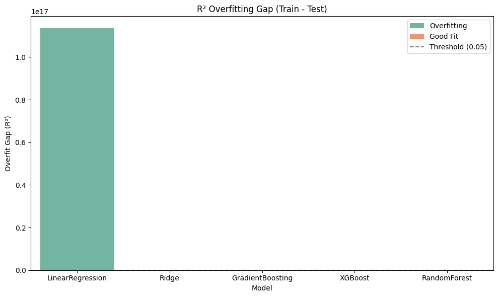
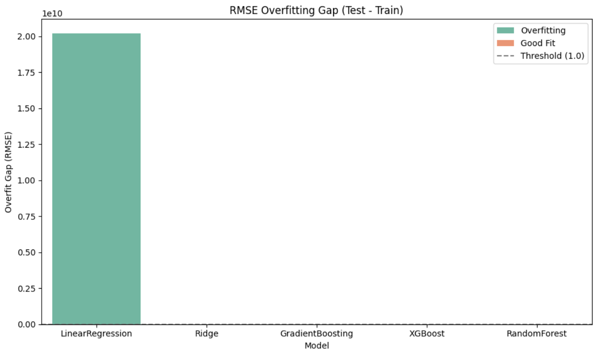

# 🚗 CO₂ Emissions Prediction Using Machine Learning

A regression-based machine learning pipeline to predict carbon dioxide (CO₂) emissions of vehicles based on their technical specifications. This project supports sustainability efforts and regulatory analysis in the automotive industry.

---

## 💼 Business Use Case

CO₂ emissions data is critical for:

- **Government policymakers** regulating emissions and vehicle taxes
- **Manufacturers** optimizing vehicle designs for fuel efficiency
- **Consumers** making informed choices based on environmental impact

By predicting CO₂ emissions from basic vehicle specs, this model enables real-time decision-making and supports the global sustainability agenda.

---

## 📌 Project Summary

- **Notebook**: `CO2_Modelling.ipynb`
- **Dataset**: 27,000+ vehicle records (Canada)
- **Target Variable**: `CO2 emissions (g/km)`
- **Learning Type**: Supervised Regression

---

## 🚀 Key Achievements

- ✅ Achieved **R² = 0.9987**, **RMSE = 2.13 g/km**
- ✅ Used advanced models: `XGBoost`, `Random Forest`, `Ridge`
- ✅ Improved RMSE by **39%** through dual feature selection and tuning
- ✅ Validated no overfitting via visual performance gap analysis

---

## 🔁 Pipeline Steps

1. **Data Cleaning**
   - Dropped irrelevant columns, handled missing values
   - Removed duplicates and treated outliers

2. **Exploratory Data Analysis (EDA)**
   - Correlation heatmaps for numerical features
   - ANOVA F-test for categorical feature significance

3. **Feature Engineering**
   - Encoded categorical features (OneHot + Ordinal)
   - Scaled numeric features using `RobustScaler`

4. **Feature Selection**
   - Combined ANOVA + Random Forest importances
   - Selected features with combined score ≥ 0.80

5. **Model Training & Evaluation**
   - Metrics: R², MAE, MSE, RMSE
   - Compared performance on training and test sets

---

## 📊 Final Model Comparison

| Model           | R² Score | RMSE (g/km) | Generalization |
|----------------|----------|-------------|----------------|
| XGBoost        | 0.9987   | 2.13        | ✅ Excellent    |
| Random Forest  | 0.9979   | 2.70        | ✅ Strong       |
| Ridge          | 0.9966   | 3.52        | ✅ Strong       |

---

## 📈 Overfitting Analysis

> Minimal difference between train and test scores confirms that the models generalize well.

### 🔹 R² Overfit Gap

### 🔹 RMSE Overfit Gap

---

## 🧠 Skills Demonstrated

- ML pipeline design and evaluation
- Dual feature selection (ANOVA + RF)
- Outlier treatment & robust scaling
- Overfitting detection and generalization checks
- Model comparison with multiple metrics
- Visual communication of model quality

---

## ⚠️ Limitations

- Dataset is limited to Canadian fuel consumption records (1995–2024)
- Hybrid and electric vehicles are underrepresented
- Temporal effects (e.g., trends by year) are not modeled

---
